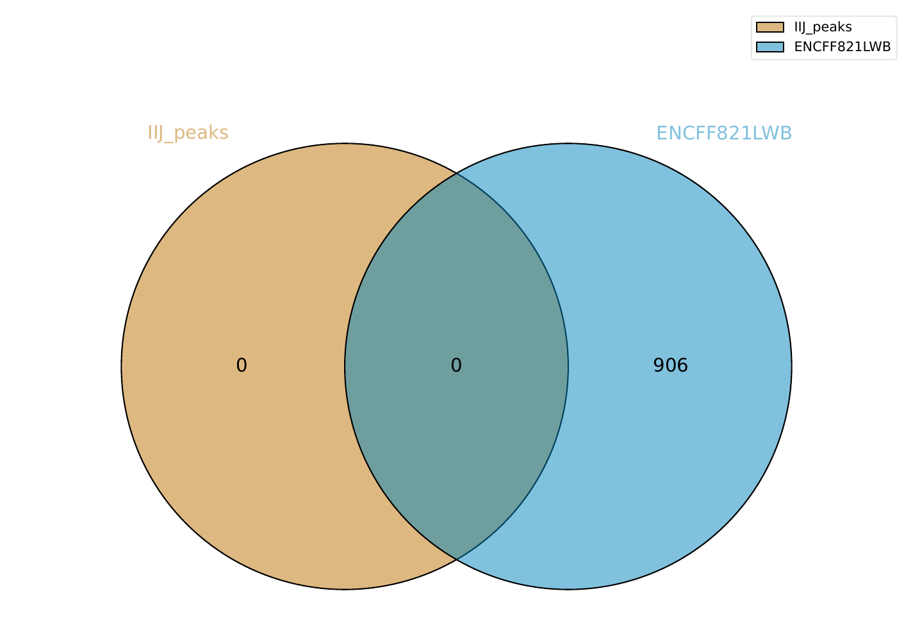
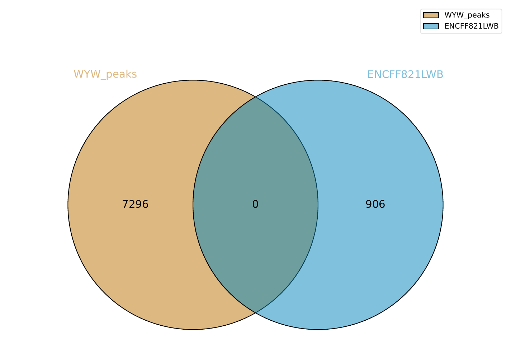

# hse\_hw2\_chip

[Colab](https://colab.research.google.com/drive/1Y8K70zhbJTSiIjMBAaAUMBVQOGsylmwG)

## Часть 1

### FastQC / MultiQC

Количество чтений


Большинство чтений с высоким качеством


Заметно падение качества в конце чтений из ENCFF630PTQ (контроль)


Много N в 36 основании чтений из ENCFF630PTQ (этим объясняется падение качества на предыдущем графике)


Есть проблемы с ENCFF630PTQ (см. выше). Также заметна неравномерность в распределении оснований (Per Base Sequence Content), но это может быть нормальной ситуацией для chip-seq.


Удаление ридов с низким качеством:

```bash
trimmomatic SE -phred33 ENCFF630PTQ.fastq ENCFF630PTQ_trimmed.fastq LEADING:3 TRAILING:3 SLIDINGWINDOW:4:15 MINLEN:36
```

Повторный анализ качества:


### Статистика выравниваний

| Образец     | Кол-во ридов | Уник. выравниваний | Неуник. выравниваний | Не выравнено      |
|-------------|--------------|--------------------|----------------------|-------------------|
| ENCFF442IIJ | 54087521     | 1816944 (3.36%)    | 7533367 (13.93%)     | 44737210 (82.71%) |
| ENCFF914WYW | 16201410     | 511562  (3.16%)    | 1645648 (10.16%)     | 14044200 (86.69%) |
| ENCFF630PTQ | 10898693     | 355825  (3.26%)    | 1373335 (12.60%)     | 9169533  (84.13%) |

> Почему процент выравниваний получился именно таким?

Выравнивание производилось на 14 хромосому, а в образцах присутствовали риды из всего генома.
Риды, которые относятся к другим хромосомам, оказались незакартированными.

### Сравнение результатов
ENCFF442IIJ        | ENCFF914WYW
-------------------|-------------------
 | 
 | 

Производилось сравнение пиков для обеих реплик, для сравнения использовались пики из ENCODE3 и ENCODE4, версия генома - hg38
(совпадает с версией, используемой при картировании).

В образце ENCFF442IIJ пиков не найдено, пики из ENCFF914WYW не пересекаются с пиками из ENCODE.

Полученный результат выглядит достаточно странно. В одной из реплик пики нашлись, значит,
исследуемая модификация гистона должна присутствовать на выбранной хромосоме.
Возможно, что-то не так с качеством второй реплики. Другой вариант - могла произойти ошибка при обработке и анализе ридов.
