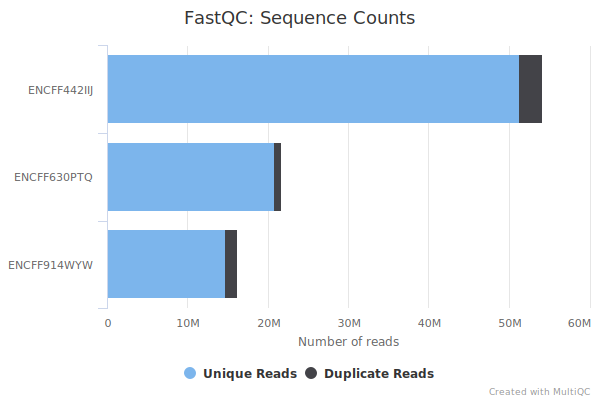
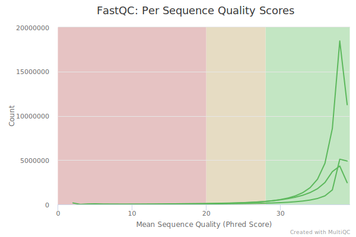
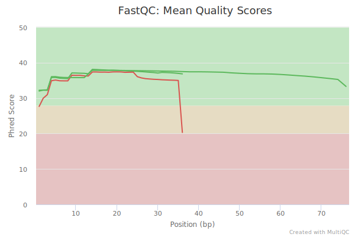
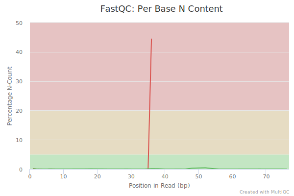
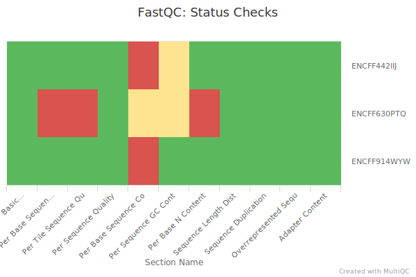
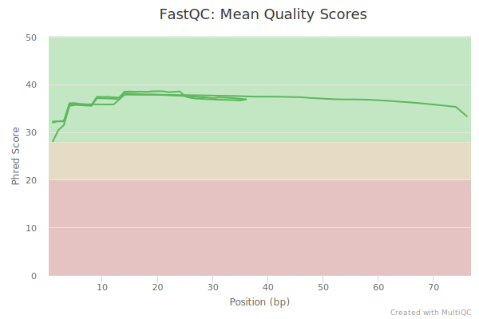
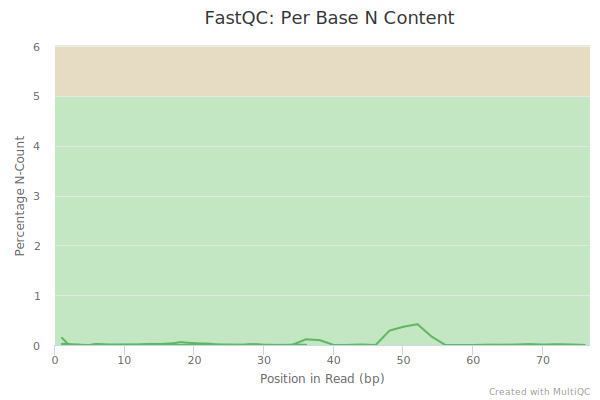

# hse\_hw2\_chip

[Colab](https://colab.research.google.com/drive/1Y8K70zhbJTSiIjMBAaAUMBVQOGsylmwG)

**TODO permissions**

## Часть 1

### FastQC / MultiQC

Количество чтений



Большинство чтений с высоким качеством



Заметно падение качества в конце чтений из ENCFF630PTQ (контроль)



Много N в 36 основании чтений из ENCFF630PTQ (этим объясняется падение качества на предыдущем графике)



Есть проблемы с ENCFF630PTQ (см. выше). Также заметна неравномерность в распределении оснований (Per Base Sequence Content), но это может быть нормальной ситуацией для chip-seq.



Удаление ридов с низким качеством:

```bash
trimmomatic SE -phred33 ENCFF630PTQ.fastq ENCFF630PTQ_trimmed.fastq LEADING:3 TRAILING:3 SLIDINGWINDOW:4:15 MINLEN:36
```

Повторный анализ качества:




